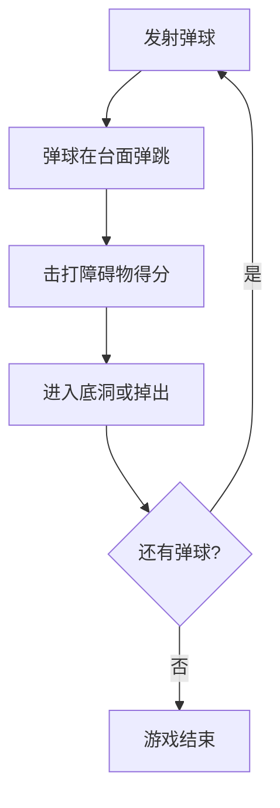

# PI-PinBall - 开放游戏设计文档 (Open GDD)

> **版本**: v1.0.0
> **最后更新**: 2026-02-21
> **状态**: ✅ 生效
> **修改历史**: 
> - 2026-02-21 v1.0.0: 初始版本，基于game/pin-ball GDD优化重构

---

## 1. 游戏概述 {#overview}

- **类型**: 2D弹珠台 / 街机物理游戏
- **目标平台**: Windows / macOS / Linux / Web
- **核心一句话**: 经典弹珠台游戏，玩家控制挡板保持弹球在台面上，击打障碍物得分
- **目标玩家画像**: 
  - 主要：喜欢街机游戏的休闲玩家
  - 次要：弹珠台爱好者和复古游戏粉丝
  - 寻求快速、基于技巧的游戏体验的玩家
- **验收标准**:
  - [ ] 游戏能在目标平台以60fps稳定运行
  - [ ] 核心玩法在1分钟内可上手
  - [ ] 物理反馈直观自然

---

## 2. 核心循环 {#core-loop}



- 每局时长: 3-10分钟（取决于玩家技巧）
- 循环强度: 轻度-中度
- **验收标准**:
  - [ ] 弹球能自然落入挡板区域
  - [ ] 挡板击打弹球后弹球能有效返回台面
  - [ ] 4个弹球用完后游戏正常结束

---

## 3. 角色与能力 {#character}

### 3.1 弹球 (Ball)

- **类型**: 动态物理对象 (RigidBody2D)
- **形状**: 圆形 (半径8像素)
- **物理参数**:
  - 质量: 0.5
  - 重力: 980 units/s²
  - 线性阻尼: 0.05
  - 角阻尼: 0.05
  - 弹性: 0.8
  - 摩擦力: 0.3
- **视觉**: 红色圆形 (RGB: 1, 0.2, 0.2)
- **状态**:
  - 队列中: 冻结，80%透明度
  - 活动中: 物理启用，完全不透明
  - 丢失: 掉出底部

### 3.2 挡板 (Flippers)

- **类型**: 运动学控制 (RigidBody2D, frozen)
- **形状**: 矩形 (60x12像素)
- **物理参数**:
  - 质量: 1.0
  - 弹性: 0.6
  - 摩擦力: 0.5
- **视觉**: 浅蓝色矩形 (RGB: 0.2, 0.6, 1)
- **旋转**:
  - 静止角度: 0°
  - 按下角度: 左挡板-45°, 右挡板+45°
  - 旋转速度: 1500度/秒 (更灵敏的响应)
- **位置**: 
  - 左挡板: (200, 550)
  - 右挡板: (600, 550)

### 3.3 发射器 (Launcher)

- **位置**: 台面右侧 (x=700, y=450)
- **蓄力**: 空格键长按蓄力 (0-1.0)
- **发射力**: 500-1000 (与蓄力成正比)
- **视觉反馈**: 蓄力进度条 + 发射动画

---

## 4. 障碍物系统 {#obstacles}

### 4.1 障碍物类型

#### 弹射器 (Bumpers)
- **类型**: 静态障碍物 (StaticBody2D)
- **形状**: 圆形 (半径30像素)
- **得分**: 20分
- **物理**: 弹性 0.95, 摩擦力 0.2
- **视觉**: 黄色/亮色

#### 小钉子 (Pegs)
- **类型**: 静态障碍物 (StaticBody2D)
- **形状**: 圆形 (半径8像素)
- **得分**: 5分
- **物理**: 弹性 0.8, 摩擦力 0.3
- **视觉**: 白色/浅色

#### 障碍墙 (Obstacle Walls)
- **类型**: 静态障碍物 (StaticBody2D)
- **形状**: 矩形 (40x10像素)
- **得分**: 15分
- **物理**: 弹性 0.85, 摩擦力 0.3
- **旋转**: 随机角度 (0-360°)
- **视觉**: 灰色

### 4.2 障碍物放置规则

- **数量**: 每局8个随机障碍物
- **分布**: 三种类型混合
- **禁止区域**:
  - 挡板区域: x: 150-250, 550-650, y: 500-600
  - 发射器区域: x: 650-750, y: 400-500
- **间距要求**:
  - 距台面墙壁最少50像素
  - 障碍物之间最少80像素
- **冷却时间**: 同一障碍物0.5秒内不重复得分

### 4.3 底洞 (Holds)

- **类型**: 区域检测 (Area2D)
- **得分**: 10-30分 (不同底洞不同分值)
- **功能**: 弹球进入后结算该球得分并移除
- **位置**: 台面底部中央区域

- **验收标准**:
  - [ ] 弹球与障碍物碰撞有明确的物理反馈
  - [ ] 得分在碰撞后立即显示
  - [ ] 障碍物冷却机制正常工作

---

## 5. 得分系统 {#scoring}

### 5.1 得分规则

| 障碍物类型 | 得分 | 冷却时间 |
|-----------|------|----------|
| 弹射器 (Bumper) | 20分 | 0.5秒 |
| 障碍墙 (Wall) | 15分 | 0.5秒 |
| 小钉子 (Peg) | 5分 | 0.5秒 |
| 底洞 (Hold) | 10-30分 | 无 |

### 5.2 得分显示

- **位置**: 屏幕左上角
- **格式**: "Score: {number}"
- **更新**: 实时更新
- **重置**: 游戏重启时重置

### 5.3 游戏生命

- **弹球数量**: 4个/局
- **补充**: 用完后自动补充
- **结束条件**: 所有弹球用完

- **验收标准**:
  - [ ] 得分计算正确，无遗漏
  - [ ] UI显示与实际得分同步
  - [ ] 游戏结束时显示最终得分

---

## 6. 关卡设计 {#levels}

### 6.1 台面布局

- **尺寸**: 800x600 像素
- **背景**: 深蓝灰色 (RGB: 0.1, 0.1, 0.2)
- **边界**: 四面墙壁围合
  - 顶部: 800x20 像素, y=10
  - 左侧: 20x600 像素, x=10
  - 右侧: 20x600 像素, x=790
  - 底部: 800x20 像素, y=590

### 6.2 区域划分

- **顶部区域**: 弹球队列和初始发射位置
- **中部区域**: 障碍物放置区域
- **底部区域**: 挡板和底洞区域

- **验收标准**:
  - [ ] 弹球无法逃离台面边界
  - [ ] 挡板能够有效击打弹球
  - [ ] 弹球能自然落入底洞或掉出

---

## 7. 用户界面 (UI) {#ui}

### 7.1 界面布局

- **台面区域**: 800x600 像素 (主要游戏区域)
- **UI覆盖层**: CanvasLayer 位于台面之上

### 7.2 UI元素

#### 得分显示
- **位置**: 左上角 (20, 20)
- **字体大小**: 32像素
- **颜色**: 白色
- **格式**: "Score: {score}"

#### 操作说明
- **位置**: 得分下方 (20, 70)
- **字体大小**: 16像素
- **内容**:
  - "Left/A: 左挡板"
  - "Right/D: 右挡板"
  - "Space: 蓄力发射"
  - "Esc: 暂停"

#### 弹球队列
- **位置**: 台面右侧 (x=750, y=300)
- **显示**: 堆叠的半透明弹球 (80%透明度)
- **间距**: 25像素

### 7.3 视觉反馈

- **得分更新**: 立即显示
- **弹球状态**: 
  - 队列中: 半透明 (80%透明度)
  - 活动中: 完全不透明 (100%透明度)
- **挡板激活**: 按下时旋转动画
- **发射蓄力**: 进度条可视化

- **验收标准**:
  - [ ] 所有按钮/控制有明确的视觉反馈
  - [ ] UI在不同分辨率下正常显示
  - [ ] 得分变化即时反映

---

## 8. 控制方式 {#controls}

### 8.1 按键映射

| 操作 | 按键1 | 按键2 |
|------|-------|-------|
| 左挡板 | 左方向键 | A |
| 右挡板 | 右方向键 | D |
| 发射弹球 | 下方向键 | S |
| 蓄力发射 | 空格键 | - |
| 暂停/继续 | Esc | - |

### 8.2 控制逻辑

- **挡板控制**: 
  - 按下激活，释放返回原位
  - 持续输入 (pressed action)
- **发射控制**:
  - 下方向键: 立即释放队列中的弹球
  - 空格键: 长按蓄力，释放发射
- **暂停控制**:
  - Esc: 切换暂停/继续状态

### 8.3 响应要求

- **输入延迟**: ≤1帧 (16ms @ 60fps)
- **物理更新**: 固定时间步长 60fps

- **验收标准**:
  - [ ] 所有控制响应灵敏，无明显延迟
  - [ ] 挡板动作与按键同步

---

## 9. 美术资产清单 {#assets}

### 9.1 现有资产

| 类型 | 数量 | 规格 | 状态 |
|------|------|------|------|
| 弹球 | 1 | 红色圆形, 16px直径 | ✅ 完成 |
| 挡板 | 2 | 浅蓝色矩形, 60x12px | ✅ 完成 |
| 弹射器 | 3+ | 黄色圆形, 60px直径 | ✅ 完成 |
| 小钉子 | 5+ | 白色圆形, 16px直径 | ✅ 完成 |
| 障碍墙 | 3+ | 灰色矩形, 40x10px | ✅ 完成 |
| 台面背景 | 1 | 深蓝灰色 800x600 | ✅ 完成 |
| 边界墙壁 | 4 | 灰蓝色 | ✅ 完成 |

### 9.2 资产规格

- **命名规范**: `[类型]_[名称]_[序号]` (如: `ball_red_01.png`)
- **存放路径**: `/Assets/Sprites/`
- **格式**: PNG 带透明通道

### 9.3 待添加

- [ ] 粒子特效 (弹球碰撞时)
- [ ] 得分弹出动画
- [ ] 发射器蓄力动画
- [ ] 背景音乐
- [ ] 音效 (碰撞、得分、发射)

- **验收标准**:
  - [ ] 所有资产符合命名规范
  - [ ] 视觉风格统一

---

## 10. 音频资源 {#audio}

### 10.1 背景音乐

- **风格**: 轻松的电子/街机风格
- **状态**: 待添加

### 10.2 音效列表

| 音效 | 文件名 | 状态 |
|------|--------|------|
| 弹球碰撞障碍物 | sfx_bumper.wav | 待添加 |
| 挡板击打 | sfx_flipper.wav | 待添加 |
| 弹球发射 | sfx_launch.wav | 待添加 |
| 得分 | sfx_score.wav | 待添加 |
| 游戏结束 | sfx_gameover.wav | 待添加 |

- **验收标准**:
  - [ ] 音效长度不超过1秒
  - [ ] 音效与动作同步

---

## 11. 技术约束 {#tech-constraints}

### 11.1 引擎与平台

- **引擎**: Godot Engine 4.5
- **目标平台**: Windows, macOS, Linux, Web
- **渲染器**: Forward Plus / Mobile

### 11.2 性能目标

- **帧率**: 稳定60fps
- **输入延迟**: < 16ms (1帧 @ 60fps)
- **物理**: 固定时间步长 60fps
- **内存**: < 200MB

### 11.3 物理系统

- **重力**: 980 units/s²
- **物理层**:
  - Layer 1: 弹球
  - Layer 2: 挡板
  - Layer 4: 墙壁 (含坡道/轨道)

- **验收标准**:
  - [ ] 压力测试30分钟无内存泄漏
  - [ ] 低端设备达到30fps

---

## 12. 里程碑与任务 {#milestones}

| 里程碑 | 关键产出 | 状态 |
|--------|----------|------|
| 核心玩法 | 弹球发射+挡板+碰撞得分 | ✅ 完成 |
| 障碍物系统 | 弹射器+钉子+障碍墙 | ✅ 完成 |
| UI系统 | 得分+操作说明+弹球队列 | ✅ 进行中 |
| 音效系统 | 背景音乐+音效 | ⏳ 待开发 |
| 特效系统 | 粒子+动画 | ⏳ 待开发 |
| 测试优化 | 性能优化+bug修复 | ⏳ 待处理 |

---

## 13. 修改日志 {#changelog}

- 2026-02-21 v1.0.0:
  - 初始版本创建
  - 基于game/pin-ball GDD优化重构
  - 修正挡板旋转速度 (20→1500度/秒)
  - 调整发射器位置到右侧
  - 批准人: @MasterJay

---

*文档状态: 生效*
*下次审查: 2026-02-28*

---

## 14. 详细设计规范 {#spec-detail}

### 弹球 (Ball) - ball_id: "default_ball"

```yaml
ball_id: "default_ball"
定位: "玩家控制的唯一弹球"

物理属性:
  - 质量: 0.5
  - 半径: 8像素
  - 直径: 16像素
  - 弹性: 0.8
  - 摩擦力: 0.3
  - 重力: 980 units/s²
  - 线性阻尼: 0.05
  - 角阻尼: 0.05

状态机:
  - QUEUED: "队列中，冻结，半透明80%"
  - ACTIVE: "活动中，物理启用，完全不透明"  
  - LOST: "丢失，y>600"

碰撞检测:
  - 碰撞层: "Layer 1"
  - 碰撞掩码: "Layer 2(挡板), Layer 4(墙壁/障碍物)"
  - 回调: "on_ball_collide(body)"

资产清单:
  - 精灵: "res://assets/sprites/ball_red_16px.png"
  - 碰撞形状: "CircleShape2D, radius=8"
  - 图标: "icon.svg (Ball)"

技术约束:
  - 帧同步: 固定60fps
  - 物理步: 16.67ms (1/60)
  - 最大速度: 1500 units/s
  - 内存预算: <5MB

验收标准:
  - [ ] 弹球不穿透任何障碍物
  - [ ] 碰撞响应<1帧延迟
  - [ ] 1000次碰撞无内存泄漏
```

### 挡板 (Flipper) - flipper_id: "left/right_flipper"

```yaml
flipper_id: "left_flipper"
定位: "左侧挡板，负责击打弹球"

物理属性:
  - 类型: "RigidBody2D (freeze_mode=Static)"
  - 质量: 1.0
  - 尺寸: "宽60像素 x 高12像素"
  - 弹性: 0.6
  - 摩擦力: 0.5
  - 位置: "(200, 550)"  # x, y

旋转参数:
  - 静止角度: 0度 (水平)
  - 最大角度: -45度 (逆时针)
  - 旋转速度: 1500度/秒 ⚠️ 修正: 原20度/秒过慢
  - 角加速度: 5000度/秒²
  - 回弹阻尼: 0.8

输入映射:
  - 按键: "ui_left" (Left Arrow 或 A)
  - 响应模式: "pressed (持续检测)"
  - 激活延迟: 0帧 (<16ms)

碰撞检测:
  - 碰撞层: "Layer 2"
  - 碰撞掩码: "Layer 1 (弹球)"
  - 反弹力公式: "base_force * (1.0 + ball_velocity * 0.1)"

资产清单:
  - 精灵: "res://assets/sprites/flipper_blue_60x12.png"
  - 形状: "RectangleShape2D, size=(60,12)"
  - 音效: "res://assets/audio/sfx_flipper.wav"

技术约束:
  - 响应时间: <1帧 (16ms)
  - 最小激活间隔: 50ms (防止按键抖动)
  - 动画: "使用tween或AnimationPlayer"

验收标准:
  - [ ] 按键到动作响应<16ms
  - [ ] 弹球反弹角度合理: 30-60度向上
  - [ ] 连续快速击打无丢失
  - [ ] 松手后100ms内回位

### 发射器 (Launcher) - launcher_id: "right_launcher"

```yaml
launcher_id: "right_launcher"
定位: "右侧发射器，弹球发射入口"

位置:
  - 锚点: "(700, 450)"
  - 发射角度: 向上约30度
  - 发射轨迹: "曲线滑向台面中心"

蓄力参数:
  - 最小力: 500 units
  - 最大力: 1000 units
  - 蓄力速率: "1.0/秒 (0到1需要1秒)"
  - 释放方式: "松开空格键"

输入映射:
  - 蓄力: "ui_accept (Space)" 
  - 释放: "ui_accept_pressed (释放时)"
  - 射出发射: "ui_down (Down Arrow 或 S)"

状态机:
  - IDLE: "空闲，可接受输入"
  - CHARGING: "蓄力中，进度条填充"
  - RELEASING: "释放中，弹球发射"
  - COOLDOWN: "冷却中 (0.5秒)"

资产清单:
  - 精灵: "res://assets/sprites/launcher_gray.png"
  - 进度条: "UI层CanvasLayer绘制"
  - 音效: "res://assets/audio/sfx_launch.wav"

技术约束:
  - 蓄力精度: 0.01 (百分之一)
  - 发射延迟: <2帧

验收标准:
  - [ ] 蓄力与释放响应<1帧
  - [ ] 弹球沿正确轨迹发射
  - [ ] 力度与蓄力时间成正比
```

### 障碍物基类 (Obstacle) - obstacle_id: "bumper/peg/wall"

```yaml
# 弹射器 Bumper
obstacle_id: "bumper_01"
类型: "StaticBody2D"
定位: "高得分障碍物，反弹力强"

物理属性:
  - 形状: "圆形"
  - 半径: "30像素"
  - 弹性: 0.95 ⚠️ 高反弹
  - 摩擦力: 0.2
  - 碰撞层: "Layer 4"

游戏属性:
  - 得分: 20分
  - 冷却时间: 0.5秒
  - 特效触发: "碰撞时播放粒子"

资产清单:
  - 精灵: "res://assets/sprites/bumper_yellow_60px.png"
  - 形状: "CircleShape2D, radius=30"
  - 粒子: "res://assets/particles/bumper_hit.tscn"
  - 音效: "res://assets/audio/sfx_bumper.wav"

验收标准:
  - [ ] 碰撞有明显的弹跳反馈
  - [ ] 得分即时反映在UI
  - [ ] 冷却期间不重复得分

---
# 小钉子 Peg
obstacle_id: "peg_01"
类型: "StaticBody2D"
定位: "低得分障碍物，精确打击"

物理属性:
  - 形状: "圆形"
  - 半径: "8像素"
  - 弹性: 0.8
  - 摩擦力: 0.3
  - 碰撞层: "Layer 4"

游戏属性:
  - 得分: 5分
  - 冷却时间: 0.5秒

资产清单:
  - 精灵: "res://assets/sprites/peg_white_16px.png"
  - 形状: "CircleShape2D, radius=8"

验收标准:
  - [ ] 小尺寸目标可被击中
  - [ ] 弹球偏转角度合理

---
# 障碍墙 Wall
obstacle_id: "wall_01"
类型: "StaticBody2D"
定位: "中等得分，随机角度"

物理属性:
  - 形状: "矩形"
  - 尺寸: "40x10像素"
  - 弹性: 0.85
  - 摩擦力: 0.3
  - 旋转: "随机0-360度"

游戏属性:
  - 得分: 15分
  - 冷却时间: 0.5秒

资产清单:
  - 精灵: "res://assets/sprites/wall_gray_40x10.png"
  - 形状: "RectangleShape2D, size=(40,10)"
```

### 得分系统 (Scoring System)

```yaml
scoring_system_id: "default"
定位: "弹珠台得分管理"

得分规则:
  bumper: 20分
  peg: 5分
  wall: 15分
  hold: "10-30分 (根据底洞类型)"

连击加成:
  - 2秒内击中不同障碍: "1.5x倍率"
  - 5秒内击中不同障碍: "2.0x倍率"

显示格式:
  - 当前得分: "Score: 00000 (5位补零)"
  - 得分弹出: "+20 绿色，0.5秒淡出"

数据持久化:
  - 本地存储: "user://score.dat"
  - 格式: "JSON {high_score: int, last_score: int}"

验收标准:
  - [ ] 得分计算正确无误
  - [ ] UI更新<1帧延迟
  - [ ] 游戏重启分数重置
```

### 游戏状态机 (Game State Machine)

```yaml
game_state_id: "pinball_default"

状态列表:
  - SPLASH: "启动画面，显示Logo"
  - MAIN_MENU: "主菜单，可开始/设置"
  - PLAYING: "游戏中"
  - PAUSED: "暂停"
  - GAME_OVER: "游戏结束，显示得分"

转换规则:
  SPLASH → MAIN_MENU: "2秒或任意按键"
  MAIN_MENU → PLAYING: "开始游戏"
  PLAYING → PAUSED: "Esc键"
  PAUSED → PLAYING: "Esc键"
  PLAYING → GAME_OVER: "所有弹球用完"
  GAME_OVER → MAIN_MENU: "任意按键"

验收标准:
  - [ ] 状态转换正确
  - [ ] 暂停时物理停止
  - [ ] 游戏结束显示最终得分
```

---

*详细规范版本: v1.0.0*
*更新时间: 2026-02-21*
